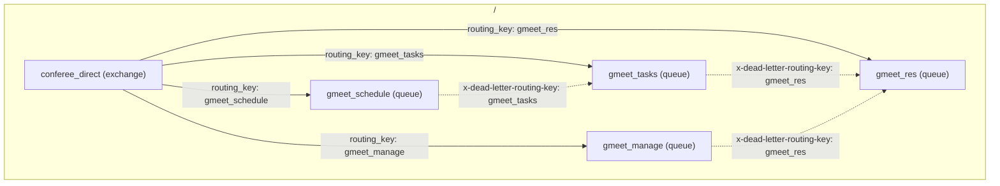

# RabbitMqService
A message broker for binding ConfereeTgBot and GMeetBot.

## Schema

## Service deployment
1. Clone `https://github.com/ConfereeBot/RabbitMqService.git`
2. Start container `docker compose up -d --build`
3. Load definitions **once** `docker exec rabbitmq rabbitmqctl import_definitions /etc/rabbitmq/definitions.json`
4. [Log in](http://localhost:15672/) with
- login: `guest`
- password: `guest`
